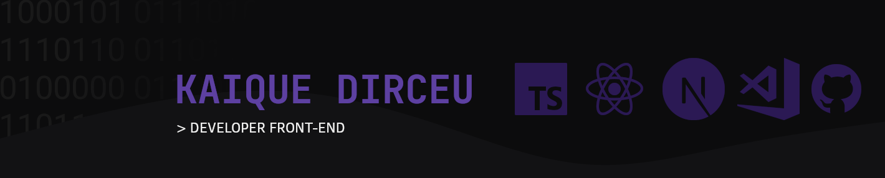

<h1 aligh="center">Hi , nice to meet you</h1>

- 💻 Computer Science Student at IFSP-PEP
- 🧑‍💻 Passionate Programmer
- ⚛️ Frontend Enthusiast
- 🎨 I enjoy UI/UX and design in general.
- 🚀 Never stop learning

<h2>Languages and tools:</h2>

<h2>Contact:</h2>
  
 
 
  
   
 

